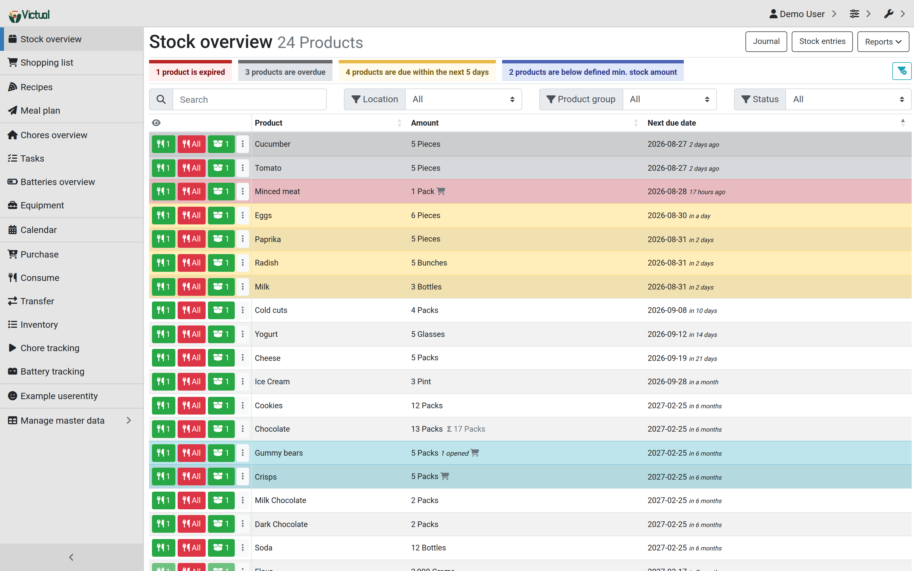
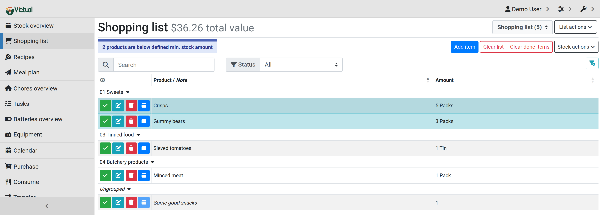
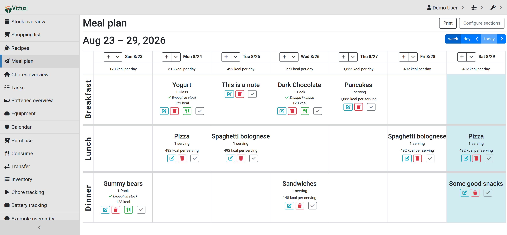
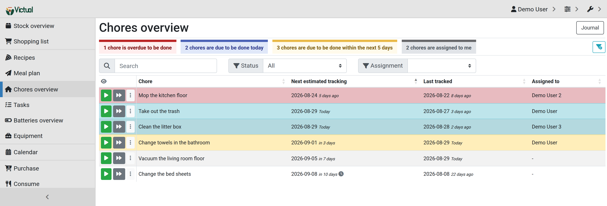

-----

<h2>ERP beyond your fridge</h2>
<h3>Victual is a web-based self-hosted groceries & household management solution for your home</h3>
<em><h4>A hard fork of <a href="https://github.com/grocy/grocy">grocy</a> by <a href="https://berrnd.de">Bernd Bestel</a></h4></em>

-----

## What this is

[grocy](https://github.com/grocy/grocy) is Bernd Bestel's household management
application, and essentially all of what is described below is his work. This is a hard
fork of it, run on k3s, that has deliberately drifted from upstream and will keep
drifting.

It is not a community distribution, a rewrite, or an attempt to replace upstream. If you
want grocy, [use grocy](https://grocy.info) — it is excellent and actively maintained.

## What this fork changes

| | Status |
|---|---|
| **PostgreSQL support** — typed baseline schema, ported views and triggers, differential tests proving the two engines agree | **landed**, see [db/pgsql/README.md](db/pgsql/README.md). [ADR-0008](docs/adr/0008-postgresql-only-runtime-engine.md) has since decided PostgreSQL becomes the *only* runtime engine and SQLite an import format; the dual-engine discipline stays in force until that retirement is scheduled and lands |
| **File storage in the database**, so the container needs no persistent volume | **landed** — `FILE_STORAGE=database`, [plan 01](docs/plans/01-file-storage.md) |
| **MQTT state publication**, so Home Assistant sees the household without polling a pod that is meant to be asleep | **landed** — [plan 18](docs/plans/18-mqtt-state-publication.md) |
| **Container images and deployment manifests** — three Nix-built images on no base image, plus a pod manifest | **first piece landed and serving** — [ADR-0013](docs/adr/0013-nix-built-container-images.md), [plan 20](docs/plans/20-container-infrastructure.md), [deploy/](deploy/README.md) |
| **MCP endpoint**, so an assistant can answer "what is expiring this week" | draft — [plan 02](docs/plans/02-mcp-endpoint.md), superseded in the body by the [interface spec](docs/mcp-interface-spec.md) |
| **Deeply nested locations and products** — hierarchies more than one level deep | draft — [07](docs/plans/07-nested-products.md) (blocked on its own Q6), [08](docs/plans/08-nested-locations.md) |
| **Location barcodes**, aimed at camera-based inventory rather than phone scanning | draft — [plan 06](docs/plans/06-location-barcodes.md) |
| Store-specific shopping lists, category-level minimum stock, seed datasets, US barcode lookup | drafts — [plans 03–05, 09](docs/plans/README.md) |
| **Hardening** — cold start and statelessness, frontend shared core, write-path transactions, frontend sink discipline | **[10](docs/plans/10-cold-start-statelessness.md), [12](docs/plans/12-frontend-shared-core.md), [13](docs/plans/13-write-path-transactions.md), [21](docs/plans/21-frontend-sink-discipline.md) landed**; API error handling ([11](docs/plans/11-api-error-handling.md)), contract scaffolding ([14](docs/plans/14-contract-and-regression-scaffolding.md) piece 2) and cleanup ([15](docs/plans/15-deliberate-cleanup.md)) outstanding |

The deployment target is immutable, scale-to-zero pods on k3s, which is what motivates
most of the divergence: PostgreSQL instead of a SQLite file, files in the database instead
of on a volume, migrations in an init step instead of on the first web request. All three
of those now work that way.

**Several of the feature plans are deliberately the requests upstream keeps closing.**
Category-level minimum stock ([#2616](https://github.com/grocy/grocy/issues/2616)), seed
product datasets ([#2679](https://github.com/grocy/grocy/issues/2679)) and store-specific
shopping lists ([#2702](https://github.com/grocy/grocy/issues/2702)) were each asked for
upstream and closed there without being built — grocy fits a very large number of
households by declining to grow for any one of them, which is a defensible policy and the
reason a fork is the honest place for this work rather than a pull request someone has to
say no to. Each of those plans links the upstream issue it came from, so the argument that
was had there is one click away.

**Start here:** [AGENTS.md](AGENTS.md) for how to work in the tree,
[docs/constitution.md](docs/constitution.md) for the standing principles,
[docs/adr/README.md](docs/adr/README.md) for the decisions in force,
[docs/plans/README.md](docs/plans/README.md) for the roadmap and what gates each piece of
work, and [docs/architecture-review.md](docs/architecture-review.md) for an honest
assessment of the codebase as it stands.

## Questions / Help / Bug Reports / Feature Requests

- **Using grocy** — [r/grocy on Reddit](https://www.reddit.com/r/grocy) and
  [grocy.info](https://grocy.info). Upstream's resources cover everything this fork shares
  with grocy, which is most of it
- **A bug in grocy itself** — [upstream's issue
  tracker](https://github.com/grocy/grocy/issues/new/choose). Reproduce it on the
  [upstream demo](https://demo-prerelease.grocy.info) first
- **A bug in something this fork added** — this repository's issue tracker. PostgreSQL and
  anything from [docs/plans/](docs/plans/README.md) is fork-only and will never reproduce
  upstream
- **A security issue** — see [SECURITY.md](.github/SECURITY.md). Unlike upstream, issues
  requiring authentication are in scope here, because this fork's threat model includes a
  multi-user household ([ADR-0006](docs/adr/0006-authenticated-issues-in-scope.md))

This repository left `grocy/grocy`'s GitHub fork network on 2026-09-04, so issues, pull
requests and comparisons default here rather than upstream. That is a GitHub fact and not
a claim about origin — the lineage and the attribution are unchanged.

Contributions are welcome, AI-assisted ones included — see
[CONTRIBUTING.md](.github/CONTRIBUTING.md).

## Give it a try

There is no demo of this fork. Upstream's demos show the shared feature set:

- Latest stable &rarr; [https://demo.grocy.info](https://demo.grocy.info)
- Development version &rarr; [https://demo-prerelease.grocy.info](https://demo-prerelease.grocy.info)

## How to install

There are two paths: a checkout on an ordinary web server, which is upstream's and still
works, and the container images this fork actually deploys.

### From a checkout

Victual is technically a pretty simple PHP application:

- Clone this repository and install Composer and Yarn dependencies
- Copy `config-dist.php` to `data/config.php` and edit to your needs
- Ensure that the `data` directory is writable
- Run `php bin/victual-migrate` to bring the schema up to date
- The webserver root should point to the `public` directory
- Include `try_files $uri /index.php$is_args$query_string;` in your location block if you
  use nginx, or disable URL rewriting (see `DISABLE_URL_REWRITING` in `data/config.php`)
- &rarr; Default login is user `admin` with password `admin`. **Change it immediately**
  (user menu, top right)

### Container images

Production images are built by Nix from [`flake.nix`](flake.nix) and [`nix/`](nix/README.md),
one image per workload, from `scratch` — no base image, no shell, no package manager, all
three running as uid 65532:

- `.#image-app` — php-fpm on loopback:9000
- `.#image-web` — nginx on :8080, holding `public/` and the yarn-built assets and no PHP
- `.#image-migrate` — `bin/victual-migrate`, run as a Job or an initContainer

`nix run .#load` builds and loads all three; on macOS that needs a Linux builder, which
[`nix/build-in-podman.sh`](nix/build-in-podman.sh) provides.
[`deploy/podman/victual.yaml`](deploy/podman/victual.yaml) is the pod — migrate
initContainer, php-fpm, nginx — and [deploy/README.md](deploy/README.md) has the
bootstrap, including the ConfigMap and Secret shapes it expects.

The root [`Dockerfile`](Dockerfile) is **not** part of this: it builds the development and
CI image the differential suite runs in, and nothing else. Its `production` target was
retired when [ADR-0013](docs/adr/0013-nix-built-container-images.md) was accepted.

Upstream images (e.g. [linuxserver/grocy](https://hub.docker.com/r/linuxserver/grocy)) run
upstream grocy, not this fork, and predate everything in the table above.

### PostgreSQL

Set `DB_DRIVER` to `pgsql` in `data/config.php` along with the `DB_*` connection settings.
A fresh, empty database is a valid target — the schema is created on first migration from
a squashed baseline rather than by replaying grocy's SQLite migration history.

To move an existing SQLite installation across, use `bin/victual-db-import`, which preserves
row ids exactly. See [db/pgsql/README.md](db/pgsql/README.md) for the porting rules, the
seventeen documented porting hazards and the two accepted behavioural differences between
the engines.

`DB_DRIVER` still defaults to `sqlite` and SQLite is still a supported runtime today, but
that is on its way out: [ADR-0008](docs/adr/0008-postgresql-only-runtime-engine.md) was
accepted on 2026-08-31 and makes PostgreSQL the sole runtime and the sole behavioural
authority, with SQLite surviving only as an input format for `bin/victual-db-import`. The
retirement itself is not yet scheduled, so until it lands every view exists on both
engines and is proved equivalent by the differential harness in `.devtools/pgsql/`.

### File storage

`FILE_STORAGE` decides where uploaded files — product pictures, recipe pictures, userfiles,
userentity pictures, manuals — are kept. The default, `filesystem`, puts them below
`<data path>/storage`. Setting it to `database` stores them as `BYTEA` rows instead, so the
application directory needs no persistent volume at all and one `pg_dump` captures a file
and the row pointing at it together. It requires `DB_DRIVER=pgsql` and is refused in
demo/prerelease mode; both are checked at startup.

Files already on disk are not read after the switch — run `php bin/victual-files-import`
once to move them in, and `php bin/victual-files-import --verify` before removing the old
storage directory. `FILE_STORAGE_MAX_SIZE_MB` bounds an upload for both backends.

### Home Assistant

Victual can push the household's ambient state to an MQTT broker as retained topics, with
Home Assistant discovery payloads alongside them, so nothing has to poll: a consumer holds
the last snapshot across its own restarts and arbitrarily long server absences. Off by
default — set `MQTT_ENABLED` and the `MQTT_*` connection settings in `data/config.php`; the
block there documents each one.

Run `bin/victual-publish-state` once after every deployment (a postStart hook, or a Job
alongside the `bin/victual-migrate` initContainer). It publishes the discovery payloads and
the full snapshot, which is what makes a migration, an import or someone in `psql` get
picked up rather than silently diverging from what the broker still holds.
`bin/victual-publish-state --retract` clears every retained topic again.

Seven summary sensors are published by default. A product also gets its own sensor when it
is opted in — `POST /api/objects/mqtt_product_entities` with `{"product_id": <id>}`, and
`DELETE` to remove it, which retracts that product's topics.

Optionally, `INFLUXDB_ENABLED` and the `INFLUXDB_*` settings write price and stock-value
*events* to InfluxDB on the same after-commit path. That channel, not MQTT, is where
spending history lives: anything holding broker credentials reads the MQTT topics without
authenticating to Victual, so no price, cost or value field is published there.

Both publishes happen after the request is finished, bounded by
`MQTT_CONNECT_TIMEOUT_SECONDS` and `INFLUXDB_TIMEOUT_SECONDS`, and a failure of either is
logged and never reaches the write that triggered it. The delay is off the response under
php-fpm and on it under mod_php — so on mod_php an unreachable broker and an unreachable
InfluxDB cost the caller the sum of those two timeouts.

### Platform support

- PHP 8.5 — what `composer.json` declares; the real language floor is 8.4 and reconciling
  the two is [plan 15](docs/plans/15-deliberate-cleanup.md)
  - Required extensions: `fileinfo`, `gd`, `ctype`, `intl`, `zlib`, `mbstring`
  - Plus the PDO driver for the engine in use — `pdo_sqlite` (SQLite 3.40+) *or*
    `pdo_pgsql`, checked per `DB_DRIVER` since
    [plan 10](docs/plans/10-cold-start-statelessness.md) landed. The Nix app and web
    images ship only `pdo_pgsql`
- Recent Firefox, Chrome or Edge

## How to update

This fork tracks no release schedule. Pull, then check `config-dist.php` for new
configuration options — values not set in `data/config.php` fall back to the defaults
there. Run `php bin/victual-migrate` afterwards; a deployment does that in its init step
instead.

`update.sh` is upstream's release-based updater and is not the path used here.

## Localization

Victual is fully localizable; the default language is English, integrated into the code.
Translations come from upstream's [Transifex
project](https://explore.transifex.com/grocy/grocy/) — strings this fork adds are not
there.

The default language can be set in `data/config.php`, e.g.
`Setting('DEFAULT_LOCALE', 'de');`, and there is a per-user setting on the user settings
page.

_RTL languages are not yet supported._

## Things worth to know

Everything in this section describes behaviour shared with upstream grocy unless noted.

### REST API

See the integrated Swagger UI instance at `/api`.

The web frontend uses exactly this API for pretty much everything, so everything you can
do there is also possible via the API.

Note for this fork: nearly every response is a database row serialised as-is, which makes
the schema the wire contract. Existing endpoints keep their response shape, and anything
that would change one is called out explicitly — see the ground rules in
[docs/plans/README.md](docs/plans/README.md).

The sentence above is upstream's and is more true of writes than of reads. The web
frontend's pages are server-rendered from direct database reads, so a handful of them —
the stock journal summary, the spendings report, the location content sheet — show data
the API cannot currently return in that shape, and the stock overview needs several calls
and a client-side join to reassemble. Closing that is scheduled work; the measurement is
in [plan 14](docs/plans/14-contract-and-regression-scaffolding.md).

Where this fork's responses differ from upstream's, the differences are measured rather
than assumed: [`.devtools/parity/`](.devtools/parity/README.md) boots this fork and grocy
4.6.0 side by side and diffs them over HTTP. Ten differences are accepted and cite the
record that accepted them — the fork returns 21 fewer settings from
`GET /api/system/config` and withholds upstream's `error_details` stack frames, among
others. The rest are open issues, not undocumented drift.

### Barcode readers & camera scanning

Some fields (with a barcode icon) also allow to select a value by scanning a barcode. It
works best when your barcode reader prefixes every barcode with a letter which is normally
not part of an item name (`$` works well) and sends a `TAB` after a scan.

It is also possible to use your device camera via the camera button on the right side of
the corresponding input field (powered by [ZXing](https://github.com/zxing-js/library),
entirely client-side). Due to browser security restrictions this only works when serving
over `https://`.

A USB barcode laser scanner works considerably better — faster, under any lighting, from
any angle.

### Barcode lookup via external services

Products can be added directly by looking them up against external services by barcode,
via the product picker workflow "External barcode lookup". A plugin for [Open Food
Facts](https://world.openfoodfacts.org/) is included and used by default (see
`STOCK_BARCODE_LOOKUP_PLUGIN`). See `plugins/DemoBarcodeLookupPlugin.php` for a commented
example if you want to build your own.

US product coverage is poor in Open Food Facts, which is what
[plan 09](docs/plans/09-barcode-lookup-sources.md) is about.

### Input shorthands for date fields

All date and time fields use ISO-8601 regardless of localization. The following shorthands
are available:

- `MMDD` &rarr; that day this year if it is still ahead, otherwise next year
  - `0517` becomes `2026-05-17`
- `YYYYMMDD` &rarr; proper ISO-8601 notation
  - `20260417` becomes `2026-04-17`
- `YYYYMMe` or `YYYYMM+` &rarr; end of that month
  - `202607e` becomes `2026-07-31`
- `[+/-]n[d/m/y]` &rarr; relative to today, adding (**+**) or subtracting (**-**) that
  **n**umber of **d**ays/**m**onths/**y**ears
  - `+1m` becomes the same day next month
- `x` &rarr; `2999-12-31`, the alias for "never overdue"
- Down/up arrows change the date by 1 day, right/left by 1 week; with Shift, by 1 month
  and 1 year respectively

### Keyboard shorthands for buttons

Wherever a button contains a bold highlighted letter, that is its shortcut key. Button
"**P** Add as new product" can be pressed with the `P` key.

### Installable web app (PWA)

The web frontend is responsive and an installable web app
([PWA](https://en.wikipedia.org/wiki/Progressive_web_app), with no offline capability),
which gives a fairly native mobile experience without additional tools.

### Database migrations

**Migrating is something you do, not something that happens to whoever sends the first
request after a deployment.** `php bin/victual-migrate` brings the schema up to date and
exits; on PostgreSQL it serialises concurrent runs on a session-level advisory lock, so
two pods starting together are safe. An application that finds the schema out of date
refuses to serve rather than guessing.

Upstream migrates from inside the root (`/`) route. That behaviour is still available for
an installation with no init step to run the CLI from — set `MIGRATE_ON_ROOT_REQUEST`,
which is **off by default** — but it is no longer the only way, which is what
[plan 10](docs/plans/10-cold-start-statelessness.md) changed. Inside a web request it does
not survive a scale-to-zero deployment: on an ephemeral filesystem it happens on every
cold start, and two pods starting together race.

The advisory lock lives on the connection that took it, so `bin/victual-migrate` has to
reach PostgreSQL over a direct connection or a session-mode pool entry — behind a
transaction-mode pooler the unlock can land on a different backend and leak permanently.

Migrations are supposed to work between releases, not between every commit.

### Disable certain features

Feature flags per major feature set hide and disable the related UI — see
`config-dist.php`. Useful if you do not use Chores, for instance.

### Adding your own CSS or JS

- If `data/custom_js.html` exists, its contents are added just before `</body>` on every page
- If `data/custom_css.html` exists, its contents are added just before `</head>` on every page

### Demo mode

When `MODE` is set to `dev`, `demo` or `prerelease`, the application runs in demo mode:
**authentication is disabled** and demo data is generated on a request to the root (`/`)
route (pass `?nodemodata` to skip that). Demo data generation is SQLite-only in this fork
and is skipped with a line on stderr on any other driver.

### Configuration outside `config.php`

Every `Setting()` in `config-dist.php` can be set without editing a file, in this order of
precedence: a `<SettingName>.txt` file in `<data path>/settingoverrides`, then a
`VICTUAL_<SettingName>` environment variable, then the default. `VICTUAL_DATAPATH` moves
the data directory itself.

This is how the container images are configured — see the ConfigMap and Secret in
[deploy/README.md](deploy/README.md), which set `VICTUAL_DB_*`, `VICTUAL_FILE_STORAGE` and
the rest rather than shipping a `config.php`.

### Embedded mode

When the file `embedded.txt` exists it must contain a valid, writable path, used as the
data directory instead of `data`; authentication is disabled.

## Roadmap

Upstream has none by policy. This fork does, and it is three separable things:

- [**docs/plans/**](docs/plans/README.md) — *work*, one document per package, each with
  numbered open questions so individual decisions can be argued with rather than accepted
  wholesale. A plan that has landed carries an **Executed** section recording what
  actually shipped, including where it diverged. The status table there is the authority
  on what is real
- [**docs/adr/**](docs/adr/README.md) — *decisions*, which outlive the plan that made
  them. A record is Accepted in its own pull request carrying bookkeeping only, and is
  superseded rather than edited
- [**docs/constitution.md**](docs/constitution.md) — the standing principles that should
  be true of any decision or plan before it is written

## Screenshots

This fork, running its own demo dataset — not upstream's screenshots.

### Stock overview

### Shopping List

### Meal Plan

### Chores overview

## Motivation

Upstream's, in Bernd Bestel's words:

> A household needs to be managed. Before Grocy I did this (for almost 10 years) using my
> first self written software (a C# Windows forms application) and with a bunch of Excel
> sheets. The software was a pain to use at the end and Excel is Excel. So I searched for
> and tried different things for a (very) long time, nothing 100 % fitted, so this is my
> aim for a "complete household management"-thing. ERP your fridge!

This fork's motivation is narrower: run that on k3s properly, on PostgreSQL, with
hierarchies deep enough for a real pantry.

The PostgreSQL half of that is not an aesthetic preference. Upstream's position is that
backing up SQLite is easy, and it is — if you have a mutable container, a bind mount, or a
VM. It is not easy in some of the distributions grocy is published through. The Home
Assistant add-on is where this fork's maintainer got burned: the add-on in use was
abandoned, and moving to a maintained one meant prising a SQLite file out of a packaging
layer that had never been built to hand it over.

A database the application reaches over the network changes what that costs. `pg_dump`
works the same way from anywhere, whoever packaged the thing that is talking to it, and
with `FILE_STORAGE=database` it captures the uploaded files in the same stream rather than
in a second one that can disagree with the first. That is data outliving its packaging,
which is a different property from data being easy to back up when everything is going
well.

If grocy is useful to you, [say thanks to Bernd](https://grocy.info/#say-thanks) — this
fork adds nothing to it that is worth paying for.

## License

Two licenses apply, depending on which part of the code is in question:

- **Code originating from upstream grocy** — MIT, © Bernd Bestel
- **Changes and additions made in this fork** — BSD 3-Clause, © Steven Peterson

Both texts, and how they interact, are in [LICENSE.md](LICENSE.md).
